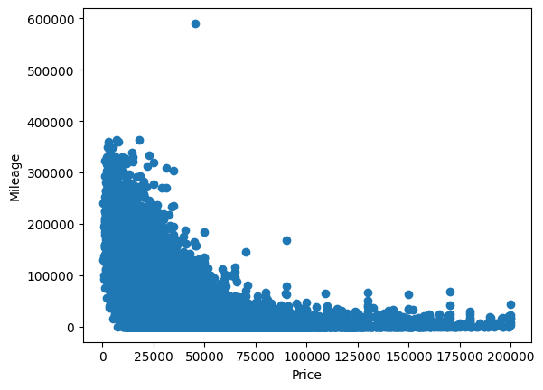
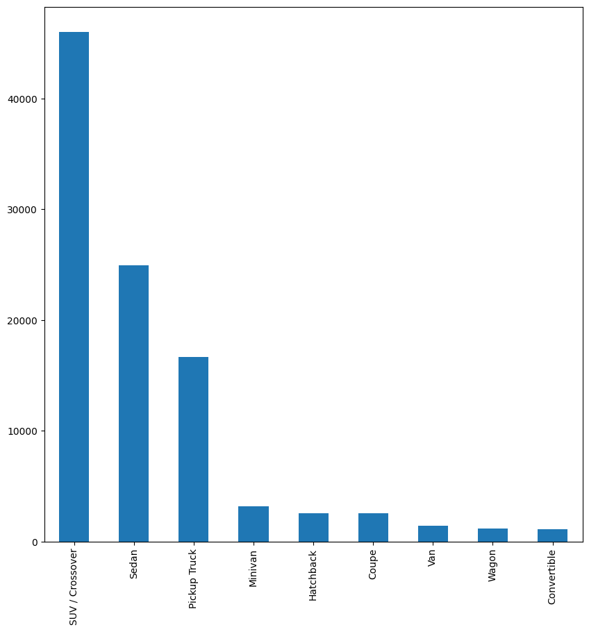

# Resold Cars Finale

## Group Members
- Emmanuel Antwi
- Luis Martinez
- Matt George
- Rashidah Namutebi
- Steven Steinbring
- Hunter Gilliam


## Dataset Used
[US Used Cars Dataset](https://www.kaggle.com/datasets/ananaymital/us-used-cars-dataset) by Ananaymital on [Kaggle](kaggle.com)

## Python Libraries Used
- Dask
- Pandas
- Flask

# The Data
Since the data was provided to us, all we needed to do was load it into a dataframe. The first issue we ran into, was that the data file was
too big to be loaded directly into a Pandas DataFrame because Pandas loads all the data into memory and we were getting errors. So, we found
a Python library that specializes in loading in larger datasets called Dask. The data was loaded in like so:

```python
import dask.dataframe as dd
import pandas as pd

df = dd.read_csv("./Data/used_cars_data.csv", dtype={'bed': 'object',
       'bed_height': 'object',
       'bed_length': 'object',
       'cabin': 'object',
       'sp_id' : 'float64',
       'dealer_zip' : 'object'})
```

We then took a look at all the columns in the dataset and decided which ones would be beneficial for our machine learning model and our
analysis. We decided to completely drop 27 columns due to some having very little data to work with and others just not beneficial for any
reason we need it. The following columns were dropped:

```python
columns_to_drop = ['savings_amount', 'width', 'description', 'engine_type', 'sp_id', 'listing_id',
                   'power', 'torque', 'trimId', 'trim_name', 'vehicle_damage_category', 'major_options', 
                   'main_picture_url', 'length', 'is_oemcpo', 'is_cpo', 'is_certified', 'height', 'front_legroom', 'fleet', 
                   'combine_fuel_economy', 'cabin', 'bed_length', 'bed_height', 'bed', 'back_legroom', 'wheelbase']
```

Once the columns were dropped from the Dask DataFrame we were then able to export it as partitioned csv files. The function ended up creating
just over 150 csv files.

Because we took out a good portion of columns, we were able to use Pandas to load all the data into one DataFrame. We used the python library
```glob``` to read through the files and import all the csv files. The code we used to do so was:

```python
import glob

# Create a pattern for the file names
pattern = 'Data/Filtered/data-*.csv'

# Use the glob module to get all the files matching the pattern
file_list = glob.glob(pattern)

# Read each file into a DataFrame and store them in a list
dfs = [pd.read_csv(file) for file in file_list]

# Concatenate all the DataFrames in the list into a single DataFrame
df = pd.concat(dfs, ignore_index=True)
```

Now we had a DataFrame with just over 2.8 million rows of data.

Visually analyzing the data, we were able to see some outliers that didn't seem to fit with the rest of the data.



As we can see, there is one loan outlier in the "Mileage" category way up just below 600,000 miles. We wanted to get rid of this outlier,
so we did by dropping anything with mileage about 400,000.

The following is a bar chart of the counts of body types.



We noticed, very obviously, that the top 3 body types were the Pickup Truck, Sedan, and SUV / Crossover with the SUV / Crossover almost doubling
the next. So we decided to make our machine learning model solely based on the ```SUV / Crossover``` body type. We have plenty of data over it
and this allows the model to be more niche to each specific body type because we could make one specifically for each.

## Model
Our goal for the model was to allow a user to predict an accurate price of a vehicle that they provide. We decided on using a ```RandomForestRegressor```
to achieve this. We had to sacrifice certain columns of data to allow for an easier experience for the user. 